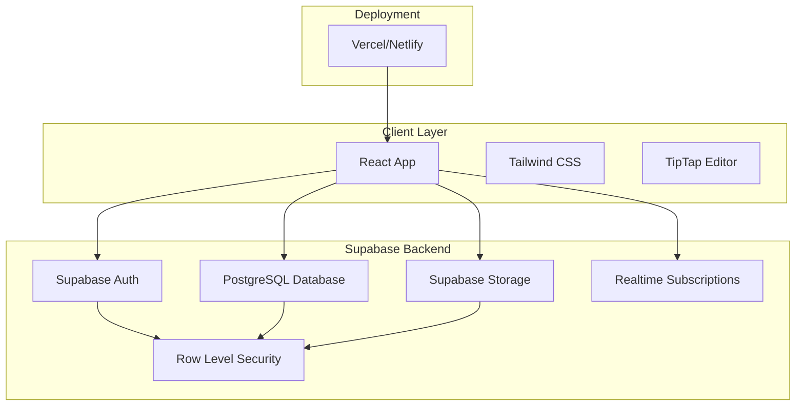
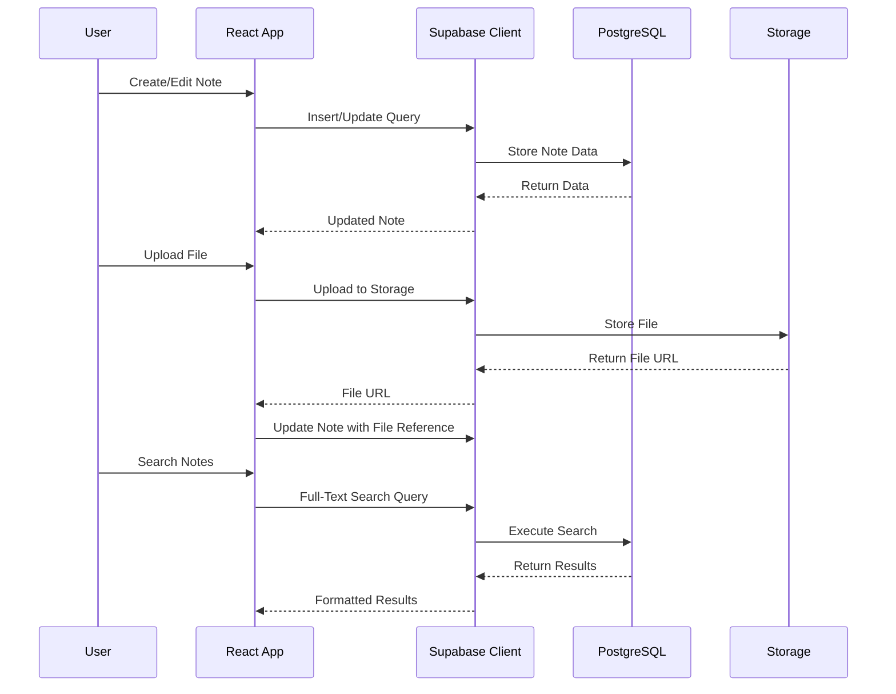

# Design Document

## Overview

The web note application is a personal note-taking system built on Supabase that provides hierarchical organization of markdown-based content with rich editing capabilities. The application follows a modern serverless architecture using Supabase services for authentication, data storage, file management, and search functionality.

### Technology Stack

- **Frontend Framework**: React with TypeScript
- **UI Component Library**: shadcn/ui (Radix UI primitives + Tailwind CSS)
- **UI Styling**: Tailwind CSS v3 (utility-first, highly customizable)
- **Form Management**: React Hook Form + Zod validation
- **Icons**: Lucide React
- **Rich Text Editor**: TipTap (extensible, markdown-compatible editor with slash commands)
- **State Management**: Zustand (lightweight, TypeScript-friendly)
- **Backend**: Supabase (PostgreSQL database with real-time capabilities)
- **Database**: PostgreSQL via Supabase
- **File Storage**: Supabase Storage
- **Authentication**: Supabase Auth
- **Search**: PostgreSQL Full-Text Search
- **Deployment**: Vercel or Netlify

## Architecture

### High-Level Architecture



### Data Flow Architecture



## UI Framework: shadcn/ui

### Why shadcn/ui?

The application uses **shadcn/ui** as the component library, which provides:

1. **Accessibility First**: Built on Radix UI primitives with WCAG 2.1 AA compliance
2. **Tree Component Support**: Collapsible and Accordion components perfect for hierarchical notebook structure
3. **Customizable**: Copy-paste approach means you own the code and can customize freely
4. **Type-Safe**: Full TypeScript support with React Hook Form + Zod validation
5. **Tailwind Integration**: Works seamlessly with Tailwind CSS (already in stack)
6. **No Package Lock-in**: Components are copied to your project, not installed as dependencies
7. **Rich Component Set**: 50+ components including forms, dialogs, dropdowns, tables, etc.
8. **Icon Library**: Includes Lucide React with 1000+ icons
9. **Active Community**: Well-maintained with excellent documentation

### Component Architecture

```
src/
├── components/
│   ├── ui/                    # shadcn/ui base components (owned by project)
│   │   ├── button.tsx
│   │   ├── card.tsx
│   │   ├── form.tsx
│   │   ├── input.tsx
│   │   ├── label.tsx
│   │   ├── collapsible.tsx   # For tree structure
│   │   ├── dialog.tsx         # For modals
│   │   ├── command.tsx        # For search/slash commands
│   │   └── ...
│   ├── auth/                  # Authentication components
│   ├── notebook/              # Notebook-specific components
│   ├── editor/                # Editor components
│   └── search/                # Search components
└── lib/
    └── utils.ts               # cn() helper for class merging
```

### Form Validation Pattern

All forms use React Hook Form + Zod for type-safe validation:

```typescript
const schema = z.object({
  email: z.string().email('Invalid email'),
  password: z.string().min(8, 'Too short'),
});

const form = useForm({
  resolver: zodResolver(schema),
  defaultValues: { email: '', password: '' },
});
```

## Components and Interfaces

### Core Components

#### 1. Authentication Components (Built with shadcn/ui)
- **LoginForm**: Handles user sign-in with email/password using React Hook Form + Zod validation
- **SignUpForm**: Manages user registration and email verification with form validation
- **AuthGuard**: Protects routes requiring authentication with loading states
- **AuthCallback**: Handles email verification and password reset callbacks
- **UI Components**: Card, Button, Input, Label, Form from shadcn/ui

#### 2. Navigation Components (shadcn/ui)
- **Sidebar**: Displays notebook tree and navigation using Collapsible components
- **NotebookTree**: Hierarchical display of notebooks and pages with Collapsible/Accordion
- **Breadcrumb**: Shows current location in hierarchy using shadcn/ui Breadcrumb
- **ScrollArea**: Scrollable container for long lists

#### 3. Content Management Components (shadcn/ui)
- **NotebookList**: Grid/list view of user's notebooks using Card components
- **NotebookCreator**: Form for creating new notebooks with Dialog and Form components
- **PageEditor**: Rich markdown editor with TipTap
- **SlashCommandMenu**: Dropdown menu for slash commands using Command component
- **FileUploader**: Drag-and-drop file upload interface with Progress component
- **VersionHistory**: List of page versions with timestamps using Table component
- **VersionComparison**: Side-by-side diff view of two versions

#### 4. Search Components (shadcn/ui)
- **SearchBar**: Global search input with scope selection using Command component
- **SearchResults**: Displays paginated search results with highlighting using Card components
- **SearchFilters**: Filters for search scope and content type using Select and Checkbox

#### 5. UI Foundation (shadcn/ui Components)
- **Base Components**: Button, Input, Label, Card, Form, Dialog, Dropdown, Popover
- **Layout Components**: Collapsible, Accordion, ScrollArea, Separator, Resizable
- **Feedback Components**: Toast, Progress, Skeleton, Badge, Alert
- **Data Components**: Table, Tabs, Tooltip
- **Icons**: Lucide React icon library (1000+ icons)

### API Interfaces

#### Supabase Database Schema

```sql
-- Enable UUID extension
CREATE EXTENSION IF NOT EXISTS "uuid-ossp";

-- Enable full-text search
CREATE EXTENSION IF NOT EXISTS pg_trgm;

-- Users table (managed by Supabase Auth)
-- auth.users is automatically created

-- Notebooks table
CREATE TABLE notebooks (
  id UUID PRIMARY KEY DEFAULT uuid_generate_v4(),
  title TEXT NOT NULL,
  description TEXT,
  user_id UUID NOT NULL REFERENCES auth.users(id) ON DELETE CASCADE,
  created_at TIMESTAMPTZ NOT NULL DEFAULT NOW(),
  updated_at TIMESTAMPTZ NOT NULL DEFAULT NOW()
);

-- Pages table
CREATE TABLE pages (
  id UUID PRIMARY KEY DEFAULT uuid_generate_v4(),
  title TEXT NOT NULL,
  content TEXT NOT NULL DEFAULT '',
  version INTEGER NOT NULL DEFAULT 1,
  parent_page_id UUID REFERENCES pages(id) ON DELETE CASCADE,
  notebook_id UUID NOT NULL REFERENCES notebooks(id) ON DELETE CASCADE,
  user_id UUID NOT NULL REFERENCES auth.users(id) ON DELETE CASCADE,
  searchable_content TSVECTOR,
  created_at TIMESTAMPTZ NOT NULL DEFAULT NOW(),
  updated_at TIMESTAMPTZ NOT NULL DEFAULT NOW()
);

-- Page versions table
CREATE TABLE page_versions (
  id UUID PRIMARY KEY DEFAULT uuid_generate_v4(),
  page_id UUID NOT NULL REFERENCES pages(id) ON DELETE CASCADE,
  title TEXT NOT NULL,
  content TEXT NOT NULL,
  version INTEGER NOT NULL,
  user_id UUID NOT NULL REFERENCES auth.users(id) ON DELETE CASCADE,
  created_at TIMESTAMPTZ NOT NULL DEFAULT NOW()
);

-- Attachments table
CREATE TABLE attachments (
  id UUID PRIMARY KEY DEFAULT uuid_generate_v4(),
  filename TEXT NOT NULL,
  file_type TEXT NOT NULL,
  file_size INTEGER NOT NULL,
  storage_path TEXT NOT NULL,
  page_id UUID NOT NULL REFERENCES pages(id) ON DELETE CASCADE,
  user_id UUID NOT NULL REFERENCES auth.users(id) ON DELETE CASCADE,
  created_at TIMESTAMPTZ NOT NULL DEFAULT NOW()
);

-- Indexes for performance
CREATE INDEX idx_notebooks_user_id ON notebooks(user_id);
CREATE INDEX idx_pages_notebook_id ON pages(notebook_id);
CREATE INDEX idx_pages_parent_page_id ON pages(parent_page_id);
CREATE INDEX idx_pages_user_id ON pages(user_id);
CREATE INDEX idx_page_versions_page_id ON page_versions(page_id);
CREATE INDEX idx_attachments_page_id ON attachments(page_id);

-- Full-text search index
CREATE INDEX idx_pages_searchable_content ON pages USING GIN(searchable_content);

-- Trigger to update searchable_content
CREATE OR REPLACE FUNCTION update_searchable_content()
RETURNS TRIGGER AS $$
BEGIN
  NEW.searchable_content := to_tsvector('english', COALESCE(NEW.title, '') || ' ' || COALESCE(NEW.content, ''));
  RETURN NEW;
END;
$$ LANGUAGE plpgsql;

CREATE TRIGGER pages_searchable_content_update
  BEFORE INSERT OR UPDATE ON pages
  FOR EACH ROW
  EXECUTE FUNCTION update_searchable_content();

-- Trigger to update updated_at
CREATE OR REPLACE FUNCTION update_updated_at()
RETURNS TRIGGER AS $$
BEGIN
  NEW.updated_at := NOW();
  RETURN NEW;
END;
$$ LANGUAGE plpgsql;

CREATE TRIGGER notebooks_updated_at
  BEFORE UPDATE ON notebooks
  FOR EACH ROW
  EXECUTE FUNCTION update_updated_at();

CREATE TRIGGER pages_updated_at
  BEFORE UPDATE ON pages
  FOR EACH ROW
  EXECUTE FUNCTION update_updated_at();

-- Row Level Security (RLS) Policies
ALTER TABLE notebooks ENABLE ROW LEVEL SECURITY;
ALTER TABLE pages ENABLE ROW LEVEL SECURITY;
ALTER TABLE page_versions ENABLE ROW LEVEL SECURITY;
ALTER TABLE attachments ENABLE ROW LEVEL SECURITY;

-- Notebooks policies
CREATE POLICY "Users can view their own notebooks"
  ON notebooks FOR SELECT
  USING (auth.uid() = user_id);

CREATE POLICY "Users can create their own notebooks"
  ON notebooks FOR INSERT
  WITH CHECK (auth.uid() = user_id);

CREATE POLICY "Users can update their own notebooks"
  ON notebooks FOR UPDATE
  USING (auth.uid() = user_id);

CREATE POLICY "Users can delete their own notebooks"
  ON notebooks FOR DELETE
  USING (auth.uid() = user_id);

-- Pages policies
CREATE POLICY "Users can view their own pages"
  ON pages FOR SELECT
  USING (auth.uid() = user_id);

CREATE POLICY "Users can create their own pages"
  ON pages FOR INSERT
  WITH CHECK (auth.uid() = user_id);

CREATE POLICY "Users can update their own pages"
  ON pages FOR UPDATE
  USING (auth.uid() = user_id);

CREATE POLICY "Users can delete their own pages"
  ON pages FOR DELETE
  USING (auth.uid() = user_id);

-- Page versions policies
CREATE POLICY "Users can view their own page versions"
  ON page_versions FOR SELECT
  USING (auth.uid() = user_id);

CREATE POLICY "Users can create their own page versions"
  ON page_versions FOR INSERT
  WITH CHECK (auth.uid() = user_id);

-- Attachments policies
CREATE POLICY "Users can view their own attachments"
  ON attachments FOR SELECT
  USING (auth.uid() = user_id);

CREATE POLICY "Users can create their own attachments"
  ON attachments FOR INSERT
  WITH CHECK (auth.uid() = user_id);

CREATE POLICY "Users can delete their own attachments"
  ON attachments FOR DELETE
  USING (auth.uid() = user_id);
```

### Component Interfaces

```typescript
interface NotebookData {
  id: string;
  title: string;
  description?: string;
  user_id: string;
  created_at: string;
  updated_at: string;
}

interface PageData {
  id: string;
  title: string;
  content: string;
  version: number;
  parent_page_id?: string;
  notebook_id: string;
  user_id: string;
  created_at: string;
  updated_at: string;
}

interface PageVersionData {
  id: string;
  page_id: string;
  title: string;
  content: string;
  version: number;
  user_id: string;
  created_at: string;
}

interface AttachmentData {
  id: string;
  filename: string;
  file_type: string;
  file_size: number;
  storage_path: string;
  page_id: string;
  user_id: string;
  created_at: string;
}

interface SearchResult {
  type: 'page' | 'notebook';
  id: string;
  title: string;
  content: string;
  notebook_title: string;
  rank: number;
}
```

### Supabase Client Configuration

```typescript
import { createClient } from '@supabase/supabase-js';

const supabaseUrl = import.meta.env.VITE_SUPABASE_URL;
const supabaseAnonKey = import.meta.env.VITE_SUPABASE_ANON_KEY;

export const supabase = createClient(supabaseUrl, supabaseAnonKey, {
  auth: {
    autoRefreshToken: true,
    persistSession: true,
    detectSessionInUrl: true
  }
});

// Database types
export type Database = {
  public: {
    Tables: {
      notebooks: {
        Row: NotebookData;
        Insert: Omit<NotebookData, 'id' | 'created_at' | 'updated_at'>;
        Update: Partial<Omit<NotebookData, 'id' | 'user_id' | 'created_at'>>;
      };
      pages: {
        Row: PageData;
        Insert: Omit<PageData, 'id' | 'created_at' | 'updated_at'>;
        Update: Partial<Omit<PageData, 'id' | 'user_id' | 'created_at'>>;
      };
      page_versions: {
        Row: PageVersionData;
        Insert: Omit<PageVersionData, 'id' | 'created_at'>;
        Update: never;
      };
      attachments: {
        Row: AttachmentData;
        Insert: Omit<AttachmentData, 'id' | 'created_at'>;
        Update: never;
      };
    };
  };
};
```

## Data Models

### Storage Structure

```
supabase-storage/
└── user-files/
    └── {user_id}/
        └── {page_id}/
            ├── images/
            ├── documents/
            └── videos/
```

### Storage Policies

```sql
-- Storage bucket for user files
INSERT INTO storage.buckets (id, name, public)
VALUES ('user-files', 'user-files', false);

-- Storage policies
CREATE POLICY "Users can upload their own files"
  ON storage.objects FOR INSERT
  WITH CHECK (
    bucket_id = 'user-files' AND
    auth.uid()::text = (storage.foldername(name))[1]
  );

CREATE POLICY "Users can view their own files"
  ON storage.objects FOR SELECT
  USING (
    bucket_id = 'user-files' AND
    auth.uid()::text = (storage.foldername(name))[1]
  );

CREATE POLICY "Users can delete their own files"
  ON storage.objects FOR DELETE
  USING (
    bucket_id = 'user-files' AND
    auth.uid()::text = (storage.foldername(name))[1]
  );
```

## Error Handling

### Error Categories

1. **Authentication Errors**
   - Invalid credentials
   - Session expiration
   - Account not verified

2. **Authorization Errors**
   - Access to other user's content
   - Insufficient permissions

3. **Validation Errors**
   - Invalid input data
   - File size/type restrictions
   - Content length limits

4. **Network Errors**
   - API timeouts
   - Connection failures
   - Service unavailability

5. **Storage Errors**
   - File upload failures
   - Storage quota exceeded
   - File corruption

### Error Handling Strategy

```typescript
interface AppError {
  code: string;
  message: string;
  details?: any;
  retryable: boolean;
}

class ErrorHandler {
  static handle(error: AppError): void {
    // Log error for monitoring
    console.error('Application Error:', error);
    
    // Show user-friendly message
    if (error.retryable) {
      showRetryableError(error.message);
    } else {
      showPermanentError(error.message);
    }
    
    // Track error for analytics
    trackError(error);
  }
  
  static fromSupabaseError(error: any): AppError {
    return {
      code: error.code || 'UNKNOWN_ERROR',
      message: error.message || 'An unexpected error occurred',
      details: error.details,
      retryable: error.code === 'PGRST301' || error.code === '08006'
    };
  }
}
```

### Retry Logic

- Network requests: Exponential backoff with max 3 retries
- File uploads: Chunked upload with resume capability
- Search queries: Immediate retry once, then fallback to simpler query

## Testing Strategy

### Unit Testing
- **Framework**: Vitest + React Testing Library
- **Coverage**: All utility functions, hooks, and components
- **Mocking**: Supabase client, external APIs

### Integration Testing
- **Database Testing**: Use Supabase local development environment
- **File Upload Testing**: Mock storage operations
- **Authentication Flow**: Mock Supabase Auth responses

### End-to-End Testing
- **Framework**: Playwright
- **Scenarios**: 
  - Complete user journey (signup → create notebook → add pages → search)
  - File upload and preview workflows
  - Export functionality
  - Cross-browser compatibility

### Performance Testing
- **Metrics**: Page load times, search response times, file upload speeds
- **Tools**: Lighthouse, WebPageTest
- **Targets**: 
  - Initial page load < 2s
  - Search results < 500ms
  - File upload progress feedback

### Security Testing
- **Authentication**: Token validation, session management
- **Authorization**: Row Level Security validation
- **File Security**: Upload validation, malware scanning
- **Data Protection**: Encryption at rest and in transit

### Testing Environment Setup

```typescript
// Test configuration
const testConfig = {
  supabaseUrl: 'http://localhost:54321',
  supabaseAnonKey: 'test-anon-key',
};

// Mock Supabase client for tests
export const createMockSupabaseClient = () => ({
  auth: {
    signUp: vi.fn(),
    signIn: vi.fn(),
    signOut: vi.fn(),
    getSession: vi.fn(),
  },
  from: vi.fn(() => ({
    select: vi.fn(),
    insert: vi.fn(),
    update: vi.fn(),
    delete: vi.fn(),
  })),
  storage: {
    from: vi.fn(() => ({
      upload: vi.fn(),
      download: vi.fn(),
      remove: vi.fn(),
    })),
  },
});
```

## Search Implementation

### Full-Text Search Query

```typescript
// Search across all user's pages
const searchPages = async (query: string, notebookId?: string) => {
  let queryBuilder = supabase
    .from('pages')
    .select('*, notebooks(title)')
    .textSearch('searchable_content', query, {
      type: 'websearch',
      config: 'english'
    });
  
  if (notebookId) {
    queryBuilder = queryBuilder.eq('notebook_id', notebookId);
  }
  
  const { data, error } = await queryBuilder;
  
  if (error) throw error;
  return data;
};
```

This design provides a comprehensive foundation for building the web note application with Supabase, leveraging PostgreSQL's powerful features like full-text search, Row Level Security, and real-time capabilities while maintaining a clean and scalable architecture.
