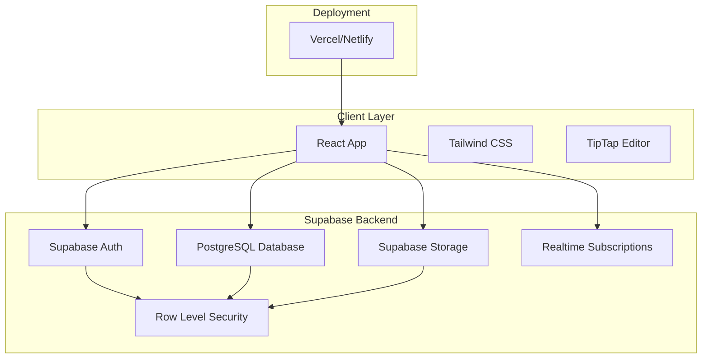
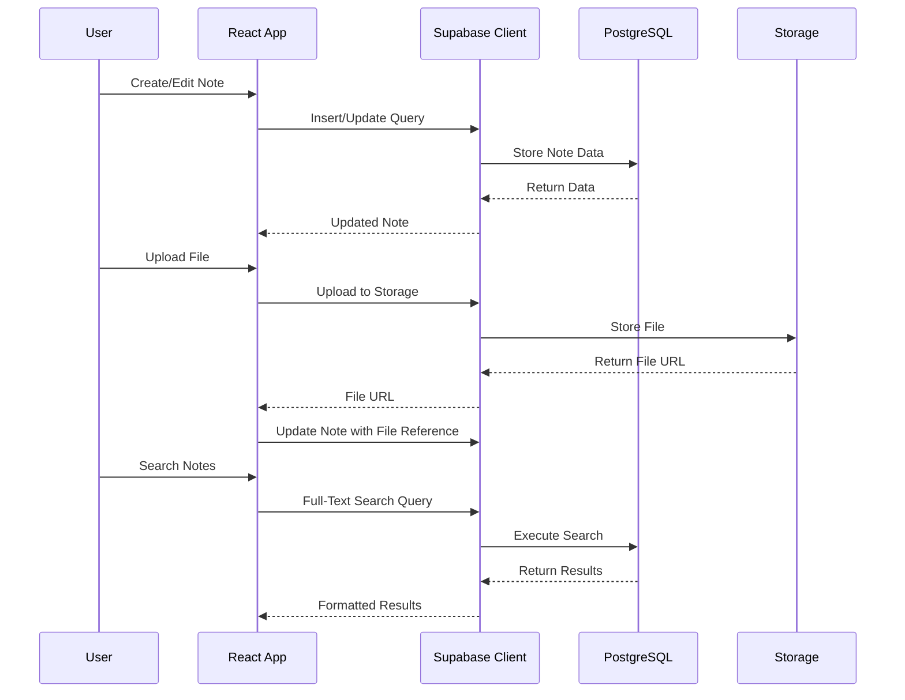
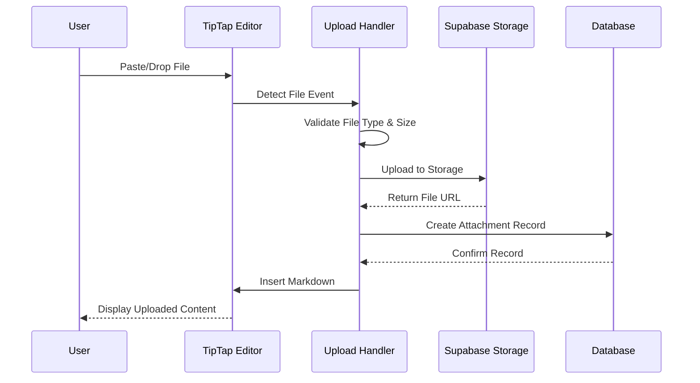
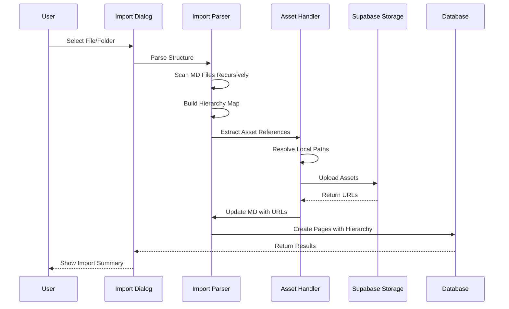

# Design Document

## Overview

The web note application is a personal note-taking system built on Supabase that provides hierarchical organization of markdown-based content with rich editing capabilities. The application follows a modern serverless architecture using Supabase services for authentication, data storage, file management, and search functionality.

### Technology Stack

- **Frontend Framework**: React with TypeScript
- **UI Component Library**: shadcn/ui (Radix UI primitives + Tailwind CSS)
- **UI Styling**: Tailwind CSS v3 (utility-first, highly customizable)
- **Form Management**: React Hook Form + Zod validation
- **Icons**: Lucide React
- **Rich Text Editor**: TipTap (extensible, markdown-compatible editor with slash commands)
- **State Management**: Zustand (lightweight, TypeScript-friendly)
- **Backend**: Supabase (PostgreSQL database with real-time capabilities)
- **Database**: PostgreSQL via Supabase
- **File Storage**: Supabase Storage
- **Authentication**: Supabase Auth
- **Search**: PostgreSQL Full-Text Search
- **Deployment**: Vercel or Netlify

## Architecture

### High-Level Architecture



### Data Flow Architecture



## UI Framework: shadcn/ui

### Why shadcn/ui?

The application uses **shadcn/ui** as the component library, which provides:

1. **Accessibility First**: Built on Radix UI primitives with WCAG 2.1 AA compliance
2. **Tree Component Support**: Collapsible and Accordion components perfect for hierarchical notebook structure
3. **Customizable**: Copy-paste approach means you own the code and can customize freely
4. **Type-Safe**: Full TypeScript support with React Hook Form + Zod validation
5. **Tailwind Integration**: Works seamlessly with Tailwind CSS (already in stack)
6. **No Package Lock-in**: Components are copied to your project, not installed as dependencies
7. **Rich Component Set**: 50+ components including forms, dialogs, dropdowns, tables, etc.
8. **Icon Library**: Includes Lucide React with 1000+ icons
9. **Active Community**: Well-maintained with excellent documentation

### Component Architecture

```
src/
├── components/
│   ├── ui/                    # shadcn/ui base components (owned by project)
│   │   ├── button.tsx
│   │   ├── card.tsx
│   │   ├── form.tsx
│   │   ├── input.tsx
│   │   ├── label.tsx
│   │   ├── collapsible.tsx   # For tree structure
│   │   ├── dialog.tsx         # For modals
│   │   ├── command.tsx        # For search/slash commands
│   │   └── ...
│   ├── auth/                  # Authentication components
│   ├── notebook/              # Notebook-specific components
│   ├── editor/                # Editor components
│   └── search/                # Search components
└── lib/
    └── utils.ts               # cn() helper for class merging
```

### Form Validation Pattern

All forms use React Hook Form + Zod for type-safe validation:

```typescript
const schema = z.object({
  email: z.string().email('Invalid email'),
  password: z.string().min(8, 'Too short'),
});

const form = useForm({
  resolver: zodResolver(schema),
  defaultValues: { email: '', password: '' },
});
```

## Components and Interfaces

### Core Components

#### 1. Authentication Components (Built with shadcn/ui)
- **LoginForm**: Handles user sign-in with email/password using React Hook Form + Zod validation
- **SignUpForm**: Manages user registration and email verification with form validation
- **AuthGuard**: Protects routes requiring authentication with loading states
- **AuthCallback**: Handles email verification and password reset callbacks
- **UI Components**: Card, Button, Input, Label, Form from shadcn/ui

#### 2. Navigation Components (shadcn/ui)
- **Sidebar**: Displays notebook tree and navigation using Collapsible components
- **NotebookTree**: Hierarchical display of notebooks and pages with Collapsible/Accordion
- **Breadcrumb**: Shows current location in hierarchy using shadcn/ui Breadcrumb
- **ScrollArea**: Scrollable container for long lists

#### 3. Content Management Components (shadcn/ui)
- **NotebookList**: Grid/list view of user's notebooks using Card components
- **NotebookCreator**: Form for creating new notebooks with Dialog and Form components
- **PageEditor**: Rich markdown editor with TipTap
- **SlashCommandMenu**: Dropdown menu for slash commands using Command component
- **FileUploader**: Drag-and-drop file upload interface with Progress component
- **VersionHistory**: List of page versions with timestamps using Table component
- **VersionComparison**: Side-by-side diff view of two versions

#### 4. Search Components (shadcn/ui)
- **SearchBar**: Global search input with scope selection using Command component
- **SearchResults**: Displays paginated search results with highlighting using Card components
- **SearchFilters**: Filters for search scope and content type using Select and Checkbox

#### 5. UI Foundation (shadcn/ui Components)
- **Base Components**: Button, Input, Label, Card, Form, Dialog, Dropdown, Popover
- **Layout Components**: Collapsible, Accordion, ScrollArea, Separator, Resizable
- **Feedback Components**: Toast, Progress, Skeleton, Badge, Alert
- **Data Components**: Table, Tabs, Tooltip
- **Icons**: Lucide React icon library (1000+ icons)

### API Interfaces

#### Supabase Database Schema

```sql
-- Enable UUID extension
CREATE EXTENSION IF NOT EXISTS "uuid-ossp";

-- Enable full-text search
CREATE EXTENSION IF NOT EXISTS pg_trgm;

-- Users table (managed by Supabase Auth)
-- auth.users is automatically created

-- Notebooks table
CREATE TABLE notebooks (
  id UUID PRIMARY KEY DEFAULT uuid_generate_v4(),
  title TEXT NOT NULL,
  description TEXT,
  user_id UUID NOT NULL REFERENCES auth.users(id) ON DELETE CASCADE,
  created_at TIMESTAMPTZ NOT NULL DEFAULT NOW(),
  updated_at TIMESTAMPTZ NOT NULL DEFAULT NOW()
);

-- Pages table
CREATE TABLE pages (
  id UUID PRIMARY KEY DEFAULT uuid_generate_v4(),
  title TEXT NOT NULL,
  content TEXT NOT NULL DEFAULT '',
  version INTEGER NOT NULL DEFAULT 1,
  parent_page_id UUID REFERENCES pages(id) ON DELETE CASCADE,
  notebook_id UUID NOT NULL REFERENCES notebooks(id) ON DELETE CASCADE,
  user_id UUID NOT NULL REFERENCES auth.users(id) ON DELETE CASCADE,
  searchable_content TSVECTOR,
  created_at TIMESTAMPTZ NOT NULL DEFAULT NOW(),
  updated_at TIMESTAMPTZ NOT NULL DEFAULT NOW()
);

-- Page versions table
CREATE TABLE page_versions (
  id UUID PRIMARY KEY DEFAULT uuid_generate_v4(),
  page_id UUID NOT NULL REFERENCES pages(id) ON DELETE CASCADE,
  title TEXT NOT NULL,
  content TEXT NOT NULL,
  version INTEGER NOT NULL,
  user_id UUID NOT NULL REFERENCES auth.users(id) ON DELETE CASCADE,
  created_at TIMESTAMPTZ NOT NULL DEFAULT NOW()
);

-- Attachments table
CREATE TABLE attachments (
  id UUID PRIMARY KEY DEFAULT uuid_generate_v4(),
  filename TEXT NOT NULL,
  file_type TEXT NOT NULL,
  file_size INTEGER NOT NULL,
  storage_path TEXT NOT NULL,
  page_id UUID NOT NULL REFERENCES pages(id) ON DELETE CASCADE,
  user_id UUID NOT NULL REFERENCES auth.users(id) ON DELETE CASCADE,
  created_at TIMESTAMPTZ NOT NULL DEFAULT NOW()
);

-- Indexes for performance
CREATE INDEX idx_notebooks_user_id ON notebooks(user_id);
CREATE INDEX idx_pages_notebook_id ON pages(notebook_id);
CREATE INDEX idx_pages_parent_page_id ON pages(parent_page_id);
CREATE INDEX idx_pages_user_id ON pages(user_id);
CREATE INDEX idx_page_versions_page_id ON page_versions(page_id);
CREATE INDEX idx_attachments_page_id ON attachments(page_id);

-- Full-text search index
CREATE INDEX idx_pages_searchable_content ON pages USING GIN(searchable_content);

-- Trigger to update searchable_content
CREATE OR REPLACE FUNCTION update_searchable_content()
RETURNS TRIGGER AS $$
BEGIN
  NEW.searchable_content := to_tsvector('english', COALESCE(NEW.title, '') || ' ' || COALESCE(NEW.content, ''));
  RETURN NEW;
END;
$$ LANGUAGE plpgsql;

CREATE TRIGGER pages_searchable_content_update
  BEFORE INSERT OR UPDATE ON pages
  FOR EACH ROW
  EXECUTE FUNCTION update_searchable_content();

-- Trigger to update updated_at
CREATE OR REPLACE FUNCTION update_updated_at()
RETURNS TRIGGER AS $$
BEGIN
  NEW.updated_at := NOW();
  RETURN NEW;
END;
$$ LANGUAGE plpgsql;

CREATE TRIGGER notebooks_updated_at
  BEFORE UPDATE ON notebooks
  FOR EACH ROW
  EXECUTE FUNCTION update_updated_at();

CREATE TRIGGER pages_updated_at
  BEFORE UPDATE ON pages
  FOR EACH ROW
  EXECUTE FUNCTION update_updated_at();

-- Row Level Security (RLS) Policies
ALTER TABLE notebooks ENABLE ROW LEVEL SECURITY;
ALTER TABLE pages ENABLE ROW LEVEL SECURITY;
ALTER TABLE page_versions ENABLE ROW LEVEL SECURITY;
ALTER TABLE attachments ENABLE ROW LEVEL SECURITY;

-- Notebooks policies
CREATE POLICY "Users can view their own notebooks"
  ON notebooks FOR SELECT
  USING (auth.uid() = user_id);

CREATE POLICY "Users can create their own notebooks"
  ON notebooks FOR INSERT
  WITH CHECK (auth.uid() = user_id);

CREATE POLICY "Users can update their own notebooks"
  ON notebooks FOR UPDATE
  USING (auth.uid() = user_id);

CREATE POLICY "Users can delete their own notebooks"
  ON notebooks FOR DELETE
  USING (auth.uid() = user_id);

-- Pages policies
CREATE POLICY "Users can view their own pages"
  ON pages FOR SELECT
  USING (auth.uid() = user_id);

CREATE POLICY "Users can create their own pages"
  ON pages FOR INSERT
  WITH CHECK (auth.uid() = user_id);

CREATE POLICY "Users can update their own pages"
  ON pages FOR UPDATE
  USING (auth.uid() = user_id);

CREATE POLICY "Users can delete their own pages"
  ON pages FOR DELETE
  USING (auth.uid() = user_id);

-- Page versions policies
CREATE POLICY "Users can view their own page versions"
  ON page_versions FOR SELECT
  USING (auth.uid() = user_id);

CREATE POLICY "Users can create their own page versions"
  ON page_versions FOR INSERT
  WITH CHECK (auth.uid() = user_id);

-- Attachments policies
CREATE POLICY "Users can view their own attachments"
  ON attachments FOR SELECT
  USING (auth.uid() = user_id);

CREATE POLICY "Users can create their own attachments"
  ON attachments FOR INSERT
  WITH CHECK (auth.uid() = user_id);

CREATE POLICY "Users can delete their own attachments"
  ON attachments FOR DELETE
  USING (auth.uid() = user_id);
```

### Component Interfaces

```typescript
interface NotebookData {
  id: string;
  title: string;
  description?: string;
  user_id: string;
  created_at: string;
  updated_at: string;
}

interface PageData {
  id: string;
  title: string;
  content: string;
  version: number;
  parent_page_id?: string;
  notebook_id: string;
  user_id: string;
  created_at: string;
  updated_at: string;
}

interface PageVersionData {
  id: string;
  page_id: string;
  title: string;
  content: string;
  version: number;
  user_id: string;
  created_at: string;
}

interface AttachmentData {
  id: string;
  filename: string;
  file_type: string;
  file_size: number;
  storage_path: string;
  page_id: string;
  user_id: string;
  created_at: string;
}

interface SearchResult {
  type: 'page' | 'notebook';
  id: string;
  title: string;
  content: string;
  notebook_title: string;
  rank: number;
}
```

### Supabase Client Configuration

```typescript
import { createClient } from '@supabase/supabase-js';

const supabaseUrl = import.meta.env.VITE_SUPABASE_URL;
const supabaseAnonKey = import.meta.env.VITE_SUPABASE_ANON_KEY;

export const supabase = createClient(supabaseUrl, supabaseAnonKey, {
  auth: {
    autoRefreshToken: true,
    persistSession: true,
    detectSessionInUrl: true
  }
});

// Database types
export type Database = {
  public: {
    Tables: {
      notebooks: {
        Row: NotebookData;
        Insert: Omit<NotebookData, 'id' | 'created_at' | 'updated_at'>;
        Update: Partial<Omit<NotebookData, 'id' | 'user_id' | 'created_at'>>;
      };
      pages: {
        Row: PageData;
        Insert: Omit<PageData, 'id' | 'created_at' | 'updated_at'>;
        Update: Partial<Omit<PageData, 'id' | 'user_id' | 'created_at'>>;
      };
      page_versions: {
        Row: PageVersionData;
        Insert: Omit<PageVersionData, 'id' | 'created_at'>;
        Update: never;
      };
      attachments: {
        Row: AttachmentData;
        Insert: Omit<AttachmentData, 'id' | 'created_at'>;
        Update: never;
      };
    };
  };
};
```

## Data Models

### Storage Structure

```
supabase-storage/
└── user-files/
    └── {user_id}/
        └── {page_id}/
            ├── images/
            ├── documents/
            └── videos/
```

### Storage Policies

```sql
-- Storage bucket for user files
INSERT INTO storage.buckets (id, name, public)
VALUES ('user-files', 'user-files', false);

-- Storage policies
CREATE POLICY "Users can upload their own files"
  ON storage.objects FOR INSERT
  WITH CHECK (
    bucket_id = 'user-files' AND
    auth.uid()::text = (storage.foldername(name))[1]
  );

CREATE POLICY "Users can view their own files"
  ON storage.objects FOR SELECT
  USING (
    bucket_id = 'user-files' AND
    auth.uid()::text = (storage.foldername(name))[1]
  );

CREATE POLICY "Users can delete their own files"
  ON storage.objects FOR DELETE
  USING (
    bucket_id = 'user-files' AND
    auth.uid()::text = (storage.foldername(name))[1]
  );
```

## File Upload and Auto-Upload Implementation

### Auto-Upload Architecture

The application implements seamless file upload through multiple interaction methods: paste, drag-and-drop, and slash commands. All methods automatically upload files to Supabase Storage and insert appropriate markdown syntax.

### Upload Flow



### TipTap Editor Extensions

#### Paste Handler Extension

```typescript
import { Extension } from '@tiptap/core';
import { Plugin, PluginKey } from '@tiptap/pm/state';

export const PasteHandler = Extension.create({
  name: 'pasteHandler',
  
  addProseMirrorPlugins() {
    return [
      new Plugin({
        key: new PluginKey('pasteHandler'),
        props: {
          handlePaste(view, event, slice) {
            const items = Array.from(event.clipboardData?.items || []);
            const files = items
              .filter(item => item.kind === 'file')
              .map(item => item.getAsFile())
              .filter(file => file !== null);
            
            if (files.length > 0) {
              event.preventDefault();
              // Trigger auto-upload for each file
              files.forEach(file => uploadAndInsert(file, view));
              return true;
            }
            return false;
          }
        }
      })
    ];
  }
});
```

#### Drag-and-Drop Handler Extension

```typescript
export const DragDropHandler = Extension.create({
  name: 'dragDropHandler',
  
  addProseMirrorPlugins() {
    return [
      new Plugin({
        key: new PluginKey('dragDropHandler'),
        props: {
          handleDrop(view, event, slice, moved) {
            if (moved) return false;
            
            const files = Array.from(event.dataTransfer?.files || []);
            
            if (files.length > 0) {
              event.preventDefault();
              const pos = view.posAtCoords({
                left: event.clientX,
                top: event.clientY
              });
              
              // Upload and insert at drop position
              files.forEach(file => uploadAndInsert(file, view, pos?.pos));
              return true;
            }
            return false;
          }
        }
      })
    ];
  }
});
```

### Upload Service

```typescript
interface UploadOptions {
  file: File;
  pageId: string;
  userId: string;
  onProgress?: (progress: number) => void;
}

interface UploadResult {
  url: string;
  attachmentId: string;
  filename: string;
  fileType: string;
}

class FileUploadService {
  private readonly MAX_FILE_SIZE = 50 * 1024 * 1024; // 50MB
  private readonly ALLOWED_TYPES = {
    images: ['image/jpeg', 'image/png', 'image/gif', 'image/webp', 'image/svg+xml'],
    videos: ['video/mp4', 'video/webm', 'video/ogg'],
    documents: ['application/pdf', 'text/plain', 'application/msword', 
                'application/vnd.openxmlformats-officedocument.wordprocessingml.document']
  };
  
  async uploadFile(options: UploadOptions): Promise<UploadResult> {
    const { file, pageId, userId, onProgress } = options;
    
    // Validate file
    this.validateFile(file);
    
    // Determine file category
    const category = this.getFileCategory(file.type);
    
    // Generate storage path
    const timestamp = Date.now();
    const sanitizedName = this.sanitizeFilename(file.name);
    const storagePath = `${userId}/${pageId}/${category}/${timestamp}-${sanitizedName}`;
    
    // Upload to Supabase Storage with progress tracking
    const { data, error } = await supabase.storage
      .from('user-files')
      .upload(storagePath, file, {
        cacheControl: '3600',
        upsert: false,
        onUploadProgress: (progress) => {
          const percentage = (progress.loaded / progress.total) * 100;
          onProgress?.(percentage);
        }
      });
    
    if (error) throw error;
    
    // Get public URL
    const { data: urlData } = supabase.storage
      .from('user-files')
      .getPublicUrl(storagePath);
    
    // Create attachment record
    const { data: attachment, error: dbError } = await supabase
      .from('attachments')
      .insert({
        filename: file.name,
        file_type: file.type,
        file_size: file.size,
        storage_path: storagePath,
        page_id: pageId,
        user_id: userId
      })
      .select()
      .single();
    
    if (dbError) throw dbError;
    
    return {
      url: urlData.publicUrl,
      attachmentId: attachment.id,
      filename: file.name,
      fileType: file.type
    };
  }
  
  private validateFile(file: File): void {
    if (file.size > this.MAX_FILE_SIZE) {
      throw new Error(`File size exceeds ${this.MAX_FILE_SIZE / 1024 / 1024}MB limit`);
    }
    
    const allAllowedTypes = [
      ...this.ALLOWED_TYPES.images,
      ...this.ALLOWED_TYPES.videos,
      ...this.ALLOWED_TYPES.documents
    ];
    
    if (!allAllowedTypes.includes(file.type)) {
      throw new Error(`File type ${file.type} is not supported`);
    }
  }
  
  private getFileCategory(mimeType: string): 'images' | 'videos' | 'documents' {
    if (this.ALLOWED_TYPES.images.includes(mimeType)) return 'images';
    if (this.ALLOWED_TYPES.videos.includes(mimeType)) return 'videos';
    return 'documents';
  }
  
  private sanitizeFilename(filename: string): string {
    return filename.replace(/[^a-zA-Z0-9.-]/g, '_');
  }
  
  generateMarkdown(result: UploadResult): string {
    const { url, filename, fileType } = result;
    
    if (fileType.startsWith('image/')) {
      return ``;
    } else if (fileType.startsWith('video/')) {
      return `[${filename}](${url})`;
    } else {
      return `[${filename}](${url})`;
    }
  }
}
```

### Slash Command Integration

```typescript
const fileUploadCommands = [
  {
    title: 'Image',
    command: '/image',
    icon: 'Image',
    action: (editor) => {
      const input = document.createElement('input');
      input.type = 'file';
      input.accept = 'image/*';
      input.onchange = async (e) => {
        const file = (e.target as HTMLInputElement).files?.[0];
        if (file) {
          await uploadAndInsertFile(file, editor);
        }
      };
      input.click();
    }
  },
  {
    title: 'File',
    command: '/file',
    icon: 'File',
    action: (editor) => {
      const input = document.createElement('input');
      input.type = 'file';
      input.accept = '.pdf,.doc,.docx,.txt';
      input.onchange = async (e) => {
        const file = (e.target as HTMLInputElement).files?.[0];
        if (file) {
          await uploadAndInsertFile(file, editor);
        }
      };
      input.click();
    }
  },
  {
    title: 'Video',
    command: '/video',
    icon: 'Video',
    action: (editor) => {
      const input = document.createElement('input');
      input.type = 'file';
      input.accept = 'video/*';
      input.onchange = async (e) => {
        const file = (e.target as HTMLInputElement).files?.[0];
        if (file) {
          await uploadAndInsertFile(file, editor);
        }
      };
      input.click();
    }
  }
];
```

### Progress Indication

During upload, the editor displays an inline progress indicator:

```typescript
function showUploadProgress(editor: Editor, filename: string): string {
  const placeholderId = `upload-${Date.now()}`;
  const placeholder = `⏳ Uploading ${filename}... 0%`;
  
  editor.commands.insertContent(placeholder);
  
  return placeholderId;
}

function updateUploadProgress(editor: Editor, placeholderId: string, progress: number): void {
  // Update the placeholder text with current progress
  const progressText = `⏳ Uploading... ${Math.round(progress)}%`;
  // Find and replace placeholder
}

function replaceWithMarkdown(editor: Editor, placeholderId: string, markdown: string): void {
  // Replace placeholder with actual markdown
  editor.commands.insertContent(markdown);
}
```

### File Management and Cleanup

```typescript
class FileManagementService {
  async deleteAttachment(attachmentId: string): Promise<void> {
    // Get attachment details
    const { data: attachment } = await supabase
      .from('attachments')
      .select('storage_path')
      .eq('id', attachmentId)
      .single();
    
    if (!attachment) return;
    
    // Delete from storage
    await supabase.storage
      .from('user-files')
      .remove([attachment.storage_path]);
    
    // Delete database record
    await supabase
      .from('attachments')
      .delete()
      .eq('id', attachmentId);
  }
  
  async cleanupOrphanedFiles(pageId: string): Promise<void> {
    // Get page content
    const { data: page } = await supabase
      .from('pages')
      .select('content')
      .eq('id', pageId)
      .single();
    
    if (!page) return;
    
    // Get all attachments for page
    const { data: attachments } = await supabase
      .from('attachments')
      .select('*')
      .eq('page_id', pageId);
    
    // Find attachments not referenced in content
    const orphaned = attachments?.filter(att => 
      !page.content.includes(att.storage_path) &&
      !page.content.includes(att.filename)
    ) || [];
    
    // Delete orphaned attachments
    for (const attachment of orphaned) {
      await this.deleteAttachment(attachment.id);
    }
  }
}
```

## Correctness Properties

*A property is a characteristic or behavior that should hold true across all valid executions of a system-essentially, a formal statement about what the system should do. Properties serve as the bridge between human-readable specifications and machine-verifiable correctness guarantees.*

### Import Functionality Properties

Property 1: Single file import creates matching page
*For any* markdown file with content and filename, importing that file should create exactly one page where the page title matches the filename (without extension) and the page content matches the file content
**Validates: Requirements 12.2**

Property 2: Folder scan discovers all markdown files
*For any* folder structure containing markdown files at various depths, the recursive scan should discover all markdown files regardless of nesting level
**Validates: Requirements 12.3**

Property 3: Folder import preserves hierarchy
*For any* folder containing markdown files, importing should create a parent page named after the folder with child pages for each markdown file in that folder
**Validates: Requirements 12.4**

Property 4: Nested folder hierarchy preservation
*For any* nested folder structure, the parent-child relationships in the file system should be preserved as parent-child page relationships in the database
**Validates: Requirements 12.5**

Property 5: Asset references are detected and uploaded
*For any* markdown file containing local asset references (images, documents, videos), all asset references should be detected, the assets uploaded to storage, and the markdown updated with the new URLs
**Validates: Requirements 12.6**

Property 6: Import progress is reported
*For any* import operation, progress callbacks should be invoked with increasing progress values from 0 to 100
**Validates: Requirements 12.7**

Property 7: Missing assets don't block import
*For any* markdown file referencing non-existent assets, the import should complete successfully, create the page, and include the missing assets in the error summary
**Validates: Requirements 12.8**

Property 8: Import summary accuracy
*For any* import operation, the summary should accurately report the number of pages created and assets uploaded matching the actual database and storage state
**Validates: Requirements 12.9**

## Error Handling

### Error Categories

1. **Authentication Errors**
   - Invalid credentials
   - Session expiration
   - Account not verified

2. **Authorization Errors**
   - Access to other user's content
   - Insufficient permissions

3. **Validation Errors**
   - Invalid input data
   - File size/type restrictions
   - Content length limits

4. **Network Errors**
   - API timeouts
   - Connection failures
   - Service unavailability

5. **Storage Errors**
   - File upload failures
   - Storage quota exceeded
   - File corruption

### Error Handling Strategy

```typescript
interface AppError {
  code: string;
  message: string;
  details?: any;
  retryable: boolean;
}

class ErrorHandler {
  static handle(error: AppError): void {
    // Log error for monitoring
    console.error('Application Error:', error);
    
    // Show user-friendly message
    if (error.retryable) {
      showRetryableError(error.message);
    } else {
      showPermanentError(error.message);
    }
    
    // Track error for analytics
    trackError(error);
  }
  
  static fromSupabaseError(error: any): AppError {
    return {
      code: error.code || 'UNKNOWN_ERROR',
      message: error.message || 'An unexpected error occurred',
      details: error.details,
      retryable: error.code === 'PGRST301' || error.code === '08006'
    };
  }
}
```

### Retry Logic

- Network requests: Exponential backoff with max 3 retries
- File uploads: Chunked upload with resume capability
- Search queries: Immediate retry once, then fallback to simpler query

## Testing Strategy

### Unit Testing
- **Framework**: Vitest + React Testing Library
- **Coverage**: All utility functions, hooks, and components
- **Mocking**: Supabase client, external APIs

### Integration Testing
- **Database Testing**: Use Supabase local development environment
- **File Upload Testing**: Mock storage operations
- **Authentication Flow**: Mock Supabase Auth responses

### End-to-End Testing
- **Framework**: Playwright
- **Scenarios**: 
  - Complete user journey (signup → create notebook → add pages → search)
  - File upload and preview workflows
  - Export functionality
  - Cross-browser compatibility

### Performance Testing
- **Metrics**: Page load times, search response times, file upload speeds
- **Tools**: Lighthouse, WebPageTest
- **Targets**: 
  - Initial page load < 2s
  - Search results < 500ms
  - File upload progress feedback

### Security Testing
- **Authentication**: Token validation, session management
- **Authorization**: Row Level Security validation
- **File Security**: Upload validation, malware scanning
- **Data Protection**: Encryption at rest and in transit

### Testing Environment Setup

```typescript
// Test configuration
const testConfig = {
  supabaseUrl: 'http://localhost:54321',
  supabaseAnonKey: 'test-anon-key',
};

// Mock Supabase client for tests
export const createMockSupabaseClient = () => ({
  auth: {
    signUp: vi.fn(),
    signIn: vi.fn(),
    signOut: vi.fn(),
    getSession: vi.fn(),
  },
  from: vi.fn(() => ({
    select: vi.fn(),
    insert: vi.fn(),
    update: vi.fn(),
    delete: vi.fn(),
  })),
  storage: {
    from: vi.fn(() => ({
      upload: vi.fn(),
      download: vi.fn(),
      remove: vi.fn(),
    })),
  },
});
```

## Search Implementation

### Full-Text Search Query

```typescript
// Search across all user's pages
const searchPages = async (query: string, notebookId?: string) => {
  let queryBuilder = supabase
    .from('pages')
    .select('*, notebooks(title)')
    .textSearch('searchable_content', query, {
      type: 'websearch',
      config: 'english'
    });
  
  if (notebookId) {
    queryBuilder = queryBuilder.eq('notebook_id', notebookId);
  }
  
  const { data, error } = await queryBuilder;
  
  if (error) throw error;
  return data;
};
```

## Markdown Import with Hierarchy and Asset Management

### Import Architecture

The import system allows users to import markdown files or entire folder structures into notebooks while preserving hierarchy and automatically handling asset references. The system recursively scans folders, creates corresponding page structures, and uploads referenced local files to Supabase Storage.

### Import Flow



### Import Components

#### 1. Import Dialog Component (shadcn/ui)

```typescript
interface ImportDialogProps {
  notebookId: string;
  onImportComplete: (summary: ImportSummary) => void;
}

interface ImportSummary {
  pagesCreated: number;
  assetsUploaded: number;
  errors: ImportError[];
}

interface ImportError {
  file: string;
  message: string;
  type: 'asset' | 'page' | 'parse';
}

const ImportDialog: React.FC<ImportDialogProps> = ({ notebookId, onImportComplete }) => {
  const [importMode, setImportMode] = useState<'file' | 'folder'>('file');
  const [isImporting, setIsImporting] = useState(false);
  const [progress, setProgress] = useState(0);
  
  const handleFileSelect = async (files: FileList | File[]) => {
    setIsImporting(true);
    const summary = await importService.importFiles(
      Array.from(files),
      notebookId,
      (progress) => setProgress(progress)
    );
    setIsImporting(false);
    onImportComplete(summary);
  };
  
  return (
    <Dialog>
      <DialogContent>
        <DialogHeader>
          <DialogTitle>Import Markdown Files</DialogTitle>
        </DialogHeader>
        <Tabs value={importMode} onValueChange={setImportMode}>
          <TabsList>
            <TabsTrigger value="file">Single File</TabsTrigger>
            <TabsTrigger value="folder">Folder</TabsTrigger>
          </TabsList>
        </Tabs>
        {isImporting ? (
          <Progress value={progress} />
        ) : (
          <FileDropzone onFilesSelected={handleFileSelect} />
        )}
      </DialogContent>
    </Dialog>
  );
};
```

#### 2. Import Service

```typescript
interface FileNode {
  path: string;
  name: string;
  content: string;
  isDirectory: boolean;
  children: FileNode[];
  assets: AssetReference[];
}

interface AssetReference {
  originalPath: string;
  markdownSyntax: string;
  type: 'image' | 'document' | 'video' | 'other';
  position: number;
}

interface PageCreationPlan {
  title: string;
  content: string;
  parentPath?: string;
  order: number;
}

class MarkdownImportService {
  private readonly MARKDOWN_EXTENSIONS = ['.md', '.markdown'];
  private readonly ASSET_PATTERNS = [
    /!\[([^\]]*)\]\(([^)]+)\)/g,  // Images: 
    /\[([^\]]+)\]\(([^)]+)\)/g,   // Links/files: [text](path)
  ];
  
  async importFiles(
    files: File[],
    notebookId: string,
    onProgress: (progress: number) => void
  ): Promise<ImportSummary> {
    const summary: ImportSummary = {
      pagesCreated: 0,
      assetsUploaded: 0,
      errors: []
    };
    
    try {
      // Step 1: Build file tree structure
      const fileTree = await this.buildFileTree(files);
      
      // Step 2: Parse markdown files and extract assets
      const parsedFiles = await this.parseMarkdownFiles(fileTree);
      
      // Step 3: Create page hierarchy plan
      const creationPlan = this.buildPageCreationPlan(parsedFiles);
      
      // Step 4: Upload assets and update references
      const totalAssets = parsedFiles.reduce((sum, f) => sum + f.assets.length, 0);
      let uploadedAssets = 0;
      
      for (const file of parsedFiles) {
        const updatedContent = await this.processAssets(
          file,
          notebookId,
          files,
          (assetProgress) => {
            uploadedAssets++;
            const progress = (uploadedAssets / totalAssets) * 50; // First 50% for assets
            onProgress(progress);
          }
        );
        file.content = updatedContent;
        summary.assetsUploaded += file.assets.length;
      }
      
      // Step 5: Create pages with hierarchy
      const pageMap = new Map<string, string>(); // path -> pageId
      const totalPages = creationPlan.length;
      
      for (let i = 0; i < creationPlan.length; i++) {
        const plan = creationPlan[i];
        try {
          const pageId = await this.createPage(
            plan,
            notebookId,
            pageMap
          );
          pageMap.set(plan.title, pageId);
          summary.pagesCreated++;
          
          const progress = 50 + ((i + 1) / totalPages) * 50; // Last 50% for pages
          onProgress(progress);
        } catch (error) {
          summary.errors.push({
            file: plan.title,
            message: error.message,
            type: 'page'
          });
        }
      }
      
      onProgress(100);
      return summary;
      
    } catch (error) {
      summary.errors.push({
        file: 'import',
        message: error.message,
        type: 'parse'
      });
      return summary;
    }
  }
  
  private async buildFileTree(files: File[]): Promise<FileNode[]> {
    const tree: FileNode[] = [];
    
    for (const file of files) {
      // Use webkitRelativePath for folder uploads, or name for single files
      const path = (file as any).webkitRelativePath || file.name;
      const parts = path.split('/');
      
      let currentLevel = tree;
      let currentPath = '';
      
      for (let i = 0; i < parts.length; i++) {
        const part = parts[i];
        currentPath = currentPath ? `${currentPath}/${part}` : part;
        const isLastPart = i === parts.length - 1;
        
        let node = currentLevel.find(n => n.name === part);
        
        if (!node) {
          node = {
            path: currentPath,
            name: part,
            content: '',
            isDirectory: !isLastPart,
            children: [],
            assets: []
          };
          currentLevel.push(node);
        }
        
        if (isLastPart && this.isMarkdownFile(file.name)) {
          node.content = await file.text();
        }
        
        currentLevel = node.children;
      }
    }
    
    return tree;
  }
  
  private async parseMarkdownFiles(tree: FileNode[]): Promise<FileNode[]> {
    const markdownFiles: FileNode[] = [];
    
    const traverse = (nodes: FileNode[], parentPath: string = '') => {
      for (const node of nodes) {
        if (node.isDirectory) {
          traverse(node.children, node.path);
        } else if (this.isMarkdownFile(node.name)) {
          node.assets = this.extractAssetReferences(node.content);
          markdownFiles.push(node);
        }
      }
    };
    
    traverse(tree);
    return markdownFiles;
  }
  
  private extractAssetReferences(content: string): AssetReference[] {
    const assets: AssetReference[] = [];
    
    // Match image syntax: 
    const imageRegex = /!\[([^\]]*)\]\(([^)]+)\)/g;
    let match;
    
    while ((match = imageRegex.exec(content)) !== null) {
      const [fullMatch, alt, path] = match;
      
      // Only process local file references (not URLs)
      if (!this.isUrl(path)) {
        assets.push({
          originalPath: path,
          markdownSyntax: fullMatch,
          type: this.getAssetType(path),
          position: match.index
        });
      }
    }
    
    // Match link syntax: [text](path) - but only for non-markdown files
    const linkRegex = /\[([^\]]+)\]\(([^)]+)\)/g;
    
    while ((match = linkRegex.exec(content)) !== null) {
      const [fullMatch, text, path] = match;
      
      // Only process local file references that aren't markdown files or URLs
      if (!this.isUrl(path) && !this.isMarkdownFile(path)) {
        assets.push({
          originalPath: path,
          markdownSyntax: fullMatch,
          type: this.getAssetType(path),
          position: match.index
        });
      }
    }
    
    return assets;
  }
  
  private async processAssets(
    fileNode: FileNode,
    notebookId: string,
    allFiles: File[],
    onAssetUploaded: () => void
  ): Promise<string> {
    let updatedContent = fileNode.content;
    
    // Process assets in reverse order to maintain string positions
    const sortedAssets = [...fileNode.assets].sort((a, b) => b.position - a.position);
    
    for (const asset of sortedAssets) {
      try {
        // Find the actual file in the uploaded files
        const assetFile = this.findAssetFile(asset.originalPath, fileNode.path, allFiles);
        
        if (!assetFile) {
          throw new Error(`Asset file not found: ${asset.originalPath}`);
        }
        
        // Upload to Supabase Storage
        const uploadResult = await this.uploadAsset(assetFile, notebookId);
        
        // Replace the markdown reference with the new URL
        const newMarkdown = this.generateAssetMarkdown(
          asset,
          uploadResult.url,
          assetFile.name
        );
        
        updatedContent = 
          updatedContent.slice(0, asset.position) +
          newMarkdown +
          updatedContent.slice(asset.position + asset.markdownSyntax.length);
        
        onAssetUploaded();
        
      } catch (error) {
        console.error(`Failed to process asset ${asset.originalPath}:`, error);
        // Keep original reference if upload fails
      }
    }
    
    return updatedContent;
  }
  
  private findAssetFile(assetPath: string, markdownPath: string, allFiles: File[]): File | null {
    // Resolve relative path from markdown file location
    const markdownDir = markdownPath.substring(0, markdownPath.lastIndexOf('/'));
    const resolvedPath = this.resolvePath(markdownDir, assetPath);
    
    return allFiles.find(f => {
      const filePath = (f as any).webkitRelativePath || f.name;
      return filePath === resolvedPath || filePath.endsWith(resolvedPath);
    }) || null;
  }
  
  private resolvePath(basePath: string, relativePath: string): string {
    // Handle relative paths like ../images/pic.png or ./doc.pdf
    const parts = basePath.split('/').filter(p => p);
    const relParts = relativePath.split('/');
    
    for (const part of relParts) {
      if (part === '..') {
        parts.pop();
      } else if (part !== '.') {
        parts.push(part);
      }
    }
    
    return parts.join('/');
  }
  
  private async uploadAsset(file: File, notebookId: string): Promise<{ url: string }> {
    const userId = (await supabase.auth.getUser()).data.user?.id;
    if (!userId) throw new Error('User not authenticated');
    
    const timestamp = Date.now();
    const sanitizedName = file.name.replace(/[^a-zA-Z0-9.-]/g, '_');
    const category = this.getAssetType(file.name);
    const storagePath = `${userId}/imports/${notebookId}/${category}/${timestamp}-${sanitizedName}`;
    
    const { data, error } = await supabase.storage
      .from('user-files')
      .upload(storagePath, file);
    
    if (error) throw error;
    
    const { data: urlData } = supabase.storage
      .from('user-files')
      .getPublicUrl(storagePath);
    
    return { url: urlData.publicUrl };
  }
  
  private generateAssetMarkdown(asset: AssetReference, url: string, filename: string): string {
    if (asset.type === 'image') {
      return ``;
    } else {
      return `[${filename}](${url})`;
    }
  }
  
  private buildPageCreationPlan(files: FileNode[]): PageCreationPlan[] {
    const plan: PageCreationPlan[] = [];
    const pathMap = new Map<string, number>();
    
    // Sort files by path depth to ensure parents are created first
    const sortedFiles = [...files].sort((a, b) => {
      const aDepth = a.path.split('/').length;
      const bDepth = b.path.split('/').length;
      return aDepth - bDepth;
    });
    
    for (const file of sortedFiles) {
      const pathParts = file.path.split('/');
      const parentPath = pathParts.slice(0, -1).join('/');
      
      plan.push({
        title: file.name.replace(/\.(md|markdown)$/i, ''),
        content: file.content,
        parentPath: parentPath || undefined,
        order: pathMap.get(parentPath) || 0
      });
      
      pathMap.set(parentPath, (pathMap.get(parentPath) || 0) + 1);
    }
    
    return plan;
  }
  
  private async createPage(
    plan: PageCreationPlan,
    notebookId: string,
    pageMap: Map<string, string>
  ): Promise<string> {
    const userId = (await supabase.auth.getUser()).data.user?.id;
    if (!userId) throw new Error('User not authenticated');
    
    const parentPageId = plan.parentPath ? pageMap.get(plan.parentPath) : undefined;
    
    const { data, error } = await supabase
      .from('pages')
      .insert({
        title: plan.title,
        content: plan.content,
        notebook_id: notebookId,
        parent_page_id: parentPageId,
        user_id: userId,
        version: 1
      })
      .select()
      .single();
    
    if (error) throw error;
    
    return data.id;
  }
  
  private isMarkdownFile(filename: string): boolean {
    return this.MARKDOWN_EXTENSIONS.some(ext => 
      filename.toLowerCase().endsWith(ext)
    );
  }
  
  private isUrl(path: string): boolean {
    return /^https?:\/\//i.test(path);
  }
  
  private getAssetType(filename: string): 'image' | 'document' | 'video' | 'other' {
    const ext = filename.toLowerCase().split('.').pop();
    
    const imageExts = ['jpg', 'jpeg', 'png', 'gif', 'webp', 'svg'];
    const videoExts = ['mp4', 'webm', 'ogg', 'mov'];
    const docExts = ['pdf', 'doc', 'docx', 'txt', 'csv', 'xlsx'];
    
    if (imageExts.includes(ext || '')) return 'image';
    if (videoExts.includes(ext || '')) return 'video';
    if (docExts.includes(ext || '')) return 'document';
    return 'other';
  }
}

export const importService = new MarkdownImportService();
```

#### 3. File Dropzone Component

```typescript
interface FileDropzoneProps {
  onFilesSelected: (files: File[]) => void;
  accept?: string;
  multiple?: boolean;
}

const FileDropzone: React.FC<FileDropzoneProps> = ({ 
  onFilesSelected, 
  accept = '.md,.markdown',
  multiple = true 
}) => {
  const [isDragging, setIsDragging] = useState(false);
  const inputRef = useRef<HTMLInputElement>(null);
  
  const handleDrop = (e: React.DragEvent) => {
    e.preventDefault();
    setIsDragging(false);
    
    const items = Array.from(e.dataTransfer.items);
    const files: File[] = [];
    
    // Handle folder drops using webkitGetAsEntry
    items.forEach(item => {
      const entry = item.webkitGetAsEntry();
      if (entry) {
        if (entry.isDirectory) {
          this.traverseDirectory(entry as FileSystemDirectoryEntry, files);
        } else {
          files.push(item.getAsFile()!);
        }
      }
    });
    
    onFilesSelected(files);
  };
  
  const traverseDirectory = async (
    dirEntry: FileSystemDirectoryEntry,
    files: File[]
  ) => {
    const reader = dirEntry.createReader();
    
    reader.readEntries(async (entries) => {
      for (const entry of entries) {
        if (entry.isDirectory) {
          await this.traverseDirectory(entry as FileSystemDirectoryEntry, files);
        } else {
          const fileEntry = entry as FileSystemFileEntry;
          fileEntry.file(file => files.push(file));
        }
      }
    });
  };
  
  return (
    <div
      className={cn(
        "border-2 border-dashed rounded-lg p-8 text-center cursor-pointer",
        isDragging ? "border-primary bg-primary/10" : "border-gray-300"
      )}
      onDragOver={(e) => { e.preventDefault(); setIsDragging(true); }}
      onDragLeave={() => setIsDragging(false)}
      onDrop={handleDrop}
      onClick={() => inputRef.current?.click()}
    >
      <input
        ref={inputRef}
        type="file"
        accept={accept}
        multiple={multiple}
        webkitdirectory={multiple ? "true" : undefined}
        className="hidden"
        onChange={(e) => onFilesSelected(Array.from(e.target.files || []))}
      />
      <Upload className="mx-auto h-12 w-12 text-gray-400" />
      <p className="mt-2 text-sm text-gray-600">
        Drop markdown files or folders here, or click to browse
      </p>
    </div>
  );
};
```

### Import Summary Display

```typescript
interface ImportSummaryProps {
  summary: ImportSummary;
  onClose: () => void;
}

const ImportSummaryDialog: React.FC<ImportSummaryProps> = ({ summary, onClose }) => {
  return (
    <Dialog open onOpenChange={onClose}>
      <DialogContent>
        <DialogHeader>
          <DialogTitle>Import Complete</DialogTitle>
        </DialogHeader>
        <div className="space-y-4">
          <div className="flex items-center gap-2">
            <CheckCircle className="text-green-500" />
            <span>{summary.pagesCreated} pages created</span>
          </div>
          <div className="flex items-center gap-2">
            <Upload className="text-blue-500" />
            <span>{summary.assetsUploaded} assets uploaded</span>
          </div>
          {summary.errors.length > 0 && (
            <div className="space-y-2">
              <div className="flex items-center gap-2 text-orange-500">
                <AlertCircle />
                <span>{summary.errors.length} errors occurred</span>
              </div>
              <ScrollArea className="h-32 border rounded p-2">
                {summary.errors.map((error, i) => (
                  <div key={i} className="text-sm text-gray-600">
                    <strong>{error.file}:</strong> {error.message}
                  </div>
                ))}
              </ScrollArea>
            </div>
          )}
        </div>
        <DialogFooter>
          <Button onClick={onClose}>Close</Button>
        </DialogFooter>
      </DialogContent>
    </Dialog>
  );
};
```

### Browser API Considerations

The import functionality relies on browser APIs for folder handling:

1. **File System Access API**: For modern browsers, allows recursive folder reading
2. **webkitdirectory**: Fallback for folder selection in older browsers
3. **FileReader API**: For reading file contents
4. **Drag and Drop API**: For drag-and-drop folder uploads

### Performance Considerations

1. **Chunked Processing**: Large imports are processed in batches to avoid memory issues
2. **Progress Feedback**: Real-time progress updates for user feedback
3. **Parallel Uploads**: Assets are uploaded in parallel (with concurrency limit)
4. **Error Recovery**: Failed uploads don't block the entire import process

This design provides a comprehensive foundation for building the web note application with Supabase, leveraging PostgreSQL's powerful features like full-text search, Row Level Security, and real-time capabilities while maintaining a clean and scalable architecture.
