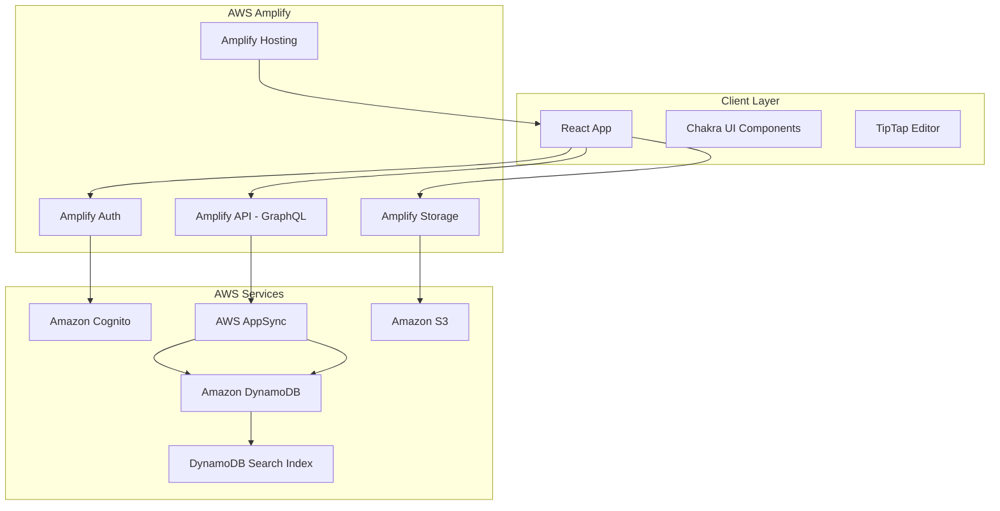
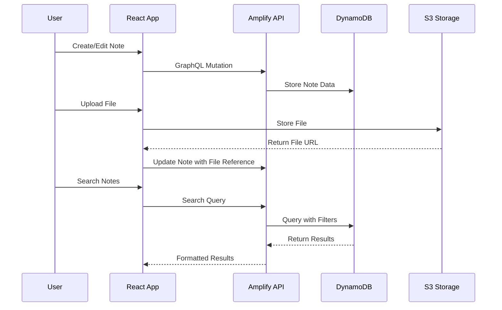

# Design Document

## Overview

The web note application is a personal note-taking system built on AWS Amplify that provides hierarchical organization of markdown-based content with rich editing capabilities. The application follows a serverless architecture using AWS services for authentication, data storage, file management, and search functionality.

### Technology Stack

- **Frontend Framework**: React with TypeScript
- **UI Component Library**: Chakra UI (mature, accessible, and highly customizable)
- **Rich Text Editor**: TipTap (extensible, markdown-compatible editor with slash commands)
- **State Management**: Zustand (lightweight, TypeScript-friendly)
- **Backend**: AWS Amplify with GraphQL API
- **Database**: Amazon DynamoDB
- **File Storage**: Amazon S3 via Amplify Storage
- **Authentication**: Amazon Cognito via Amplify Auth
- **Search**: DynamoDB with text indexing and client-side filtering
- **Deployment**: AWS Amplify Hosting

## Architecture

### High-Level Architecture



### Data Flow Architecture



## Components and Interfaces

### Core Components

#### 1. Authentication Components
- **LoginForm**: Handles user sign-in with email/password
- **SignUpForm**: Manages user registration and email verification
- **AuthGuard**: Protects routes requiring authentication

#### 2. Navigation Components
- **Sidebar**: Displays notebook tree and navigation
- **NotebookTree**: Hierarchical display of notebooks and pages
- **Breadcrumb**: Shows current location in hierarchy

#### 3. Content Management Components
- **NotebookList**: Grid/list view of user's notebooks
- **NotebookCreator**: Form for creating new notebooks
- **PageEditor**: Rich markdown editor with TipTap
- **SlashCommandMenu**: Dropdown menu for slash commands
- **FileUploader**: Drag-and-drop file upload interface
- **VersionHistory**: List of page versions with timestamps
- **VersionComparison**: Side-by-side diff view of two versions

#### 4. Search Components
- **SearchBar**: Global search input with scope selection
- **SearchResults**: Displays paginated search results with client-side highlighting
- **SearchFilters**: Filters for search scope and content type

### API Interfaces

#### GraphQL Schema

```graphql
type User @model @auth(rules: [{allow: owner}]) {
  id: ID!
  email: String!
  notebooks: [Notebook] @hasMany
  createdAt: AWSDateTime!
  updatedAt: AWSDateTime!
}

type Notebook @model @auth(rules: [{allow: owner}]) {
  id: ID!
  title: String!
  description: String
  pages: [Page] @hasMany
  owner: String! @index(name: "byOwner")
  createdAt: AWSDateTime!
  updatedAt: AWSDateTime!
}

type Page @model @auth(rules: [{allow: owner}]) {
  id: ID!
  title: String!
  content: String!
  version: Int!
  parentPageId: String @index(name: "byParent")
  notebookId: String! @index(name: "byNotebook")
  notebook: Notebook @belongsTo
  childPages: [Page] @hasMany(indexName: "byParent", fields: ["id"])
  attachments: [Attachment] @hasMany
  versions: [PageVersion] @hasMany
  owner: String! @index(name: "byOwner")
  createdAt: AWSDateTime!
  updatedAt: AWSDateTime!
}

type PageVersion @model @auth(rules: [{allow: owner}]) {
  id: ID!
  pageId: String! @index(name: "byPage")
  page: Page @belongsTo
  title: String!
  content: String!
  version: Int!
  owner: String! @index(name: "byOwner")
  createdAt: AWSDateTime!
}

type Attachment @model @auth(rules: [{allow: owner}]) {
  id: ID!
  filename: String!
  fileType: String!
  fileSize: Int!
  s3Key: String!
  pageId: String! @index(name: "byPage")
  page: Page @belongsTo
  owner: String! @index(name: "byOwner")
  createdAt: AWSDateTime!
}
```

### Component Interfaces

```typescript
interface NotebookData {
  id: string;
  title: string;
  description?: string;
  pageCount: number;
  createdAt: string;
  updatedAt: string;
}

interface PageData {
  id: string;
  title: string;
  content: string;
  version: number;
  parentPageId?: string;
  notebookId: string;
  childPages?: PageData[];
  attachments?: AttachmentData[];
  versions?: PageVersionData[];
  createdAt: string;
  updatedAt: string;
}

interface PageVersionData {
  id: string;
  pageId: string;
  title: string;
  content: string;
  version: number;
  createdAt: string;
}

interface AttachmentData {
  id: string;
  filename: string;
  fileType: string;
  fileSize: number;
  s3Key: string;
  url: string;
}

interface SearchResult {
  type: 'page' | 'notebook';
  id: string;
  title: string;
  content: string;
  notebookTitle: string;
  highlights: string[];
}
```

## Data Models

### Database Design

#### DynamoDB Tables Structure

**Users Table**
- Primary Key: `id` (User ID from Cognito)
- Attributes: `email`, `createdAt`, `updatedAt`

**Notebooks Table**
- Primary Key: `id`
- GSI: `owner-createdAt-index` for user's notebooks
- Attributes: `title`, `description`, `owner`, `createdAt`, `updatedAt`

**Pages Table**
- Primary Key: `id`
- GSI: `notebookId-createdAt-index` for notebook pages
- GSI: `parentPageId-createdAt-index` for child pages
- GSI: `owner-updatedAt-index` for user's recent pages
- Attributes: `title`, `content`, `version`, `searchableContent`, `parentPageId`, `notebookId`, `owner`, `createdAt`, `updatedAt`

**PageVersions Table**
- Primary Key: `id`
- GSI: `pageId-version-index` (pageId as PK, version as SK) for efficient version queries
- GSI: `owner-createdAt-index` for user's version history
- Attributes: `pageId`, `title`, `content`, `version`, `owner`, `createdAt`

**Attachments Table**
- Primary Key: `id`
- GSI: `pageId-createdAt-index` for page attachments
- GSI: `owner-createdAt-index` for user's files
- Attributes: `filename`, `fileType`, `fileSize`, `s3Key`, `pageId`, `owner`, `createdAt`

**DynamoDB Index Strategy**
- **Notebooks**: `owner-createdAt-index` enables efficient listing of user's notebooks
- **Pages**: Multiple GSIs support different access patterns:
  - `notebookId-createdAt-index`: List pages in a notebook (sorted by creation)
  - `parentPageId-createdAt-index`: Get child pages for hierarchy
  - `owner-updatedAt-index`: Recent pages across all notebooks
- **PageVersions**: `pageId-version-index` allows efficient version history retrieval
- **Search Implementation**: 
  - Use `owner-updatedAt-index` to scan user's pages for search
  - Apply `contains` filter on `title` and `searchableContent`
  - Use `notebookId-createdAt-index` for notebook-scoped search
  - Client-side ranking and highlighting for better UX

**Attachments Table**
- Primary Key: `id`
- GSI: `pageId-createdAt-index` for page attachments
- Attributes: `filename`, `fileType`, `fileSize`, `s3Key`, `pageId`, `owner`, `createdAt`

### File Storage Structure

```
s3://bucket-name/
├── public/
│   └── attachments/
│       └── {userId}/
│           └── {pageId}/
│               ├── images/
│               ├── documents/
│               └── videos/
```

## Error Handling

### Error Categories

1. **Authentication Errors**
   - Invalid credentials
   - Session expiration
   - Account not verified

2. **Authorization Errors**
   - Access to other user's content
   - Insufficient permissions

3. **Validation Errors**
   - Invalid input data
   - File size/type restrictions
   - Content length limits

4. **Network Errors**
   - API timeouts
   - Connection failures
   - Service unavailability

5. **Storage Errors**
   - File upload failures
   - Storage quota exceeded
   - File corruption

### Error Handling Strategy

```typescript
interface AppError {
  code: string;
  message: string;
  details?: any;
  retryable: boolean;
}

class ErrorHandler {
  static handle(error: AppError): void {
    // Log error for monitoring
    console.error('Application Error:', error);
    
    // Show user-friendly message
    if (error.retryable) {
      showRetryableError(error.message);
    } else {
      showPermanentError(error.message);
    }
    
    // Track error for analytics
    trackError(error);
  }
}
```

### Retry Logic

- Network requests: Exponential backoff with max 3 retries
- File uploads: Chunked upload with resume capability
- Search queries: Immediate retry once, then fallback to title-only search

## Testing Strategy

### Unit Testing
- **Framework**: Jest + React Testing Library
- **Coverage**: All utility functions, hooks, and components
- **Mocking**: AWS Amplify services, external APIs

### Integration Testing
- **API Testing**: GraphQL operations with test database
- **File Upload Testing**: Mock S3 operations
- **Authentication Flow**: Mock Cognito responses

### End-to-End Testing
- **Framework**: Playwright
- **Scenarios**: 
  - Complete user journey (signup → create notebook → add pages → search)
  - File upload and preview workflows
  - Export functionality
  - Cross-browser compatibility

### Performance Testing
- **Metrics**: Page load times, search response times, file upload speeds
- **Tools**: Lighthouse, WebPageTest
- **Targets**: 
  - Initial page load < 2s
  - Search results < 500ms
  - File upload progress feedback

### Security Testing
- **Authentication**: Token validation, session management
- **Authorization**: User data isolation, API access controls
- **File Security**: Upload validation, malware scanning
- **Data Protection**: Encryption at rest and in transit

### Testing Environment Setup

```typescript
// Test configuration
const testConfig = {
  amplify: {
    aws_project_region: 'us-east-1',
    aws_cognito_region: 'us-east-1',
    aws_user_pools_id: 'test-pool-id',
    aws_user_pools_web_client_id: 'test-client-id',
    aws_appsync_graphqlEndpoint: 'https://test-api.appsync-api.us-east-1.amazonaws.com/graphql',
    aws_appsync_region: 'us-east-1',
    aws_appsync_authenticationType: 'AMAZON_COGNITO_USER_POOLS',
    aws_user_files_s3_bucket: 'test-storage-bucket',
    aws_user_files_s3_bucket_region: 'us-east-1'
  }
};
```

This design provides a comprehensive foundation for building the web note application with proper separation of concerns, scalable architecture, and robust error handling while leveraging AWS Amplify's capabilities for rapid development and deployment.