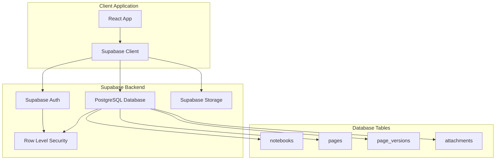
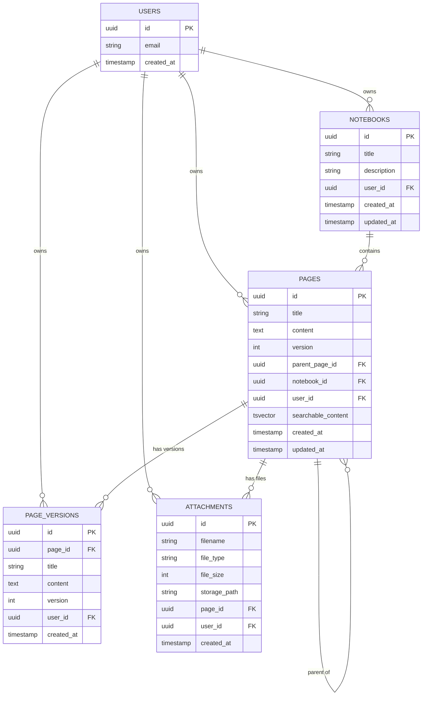
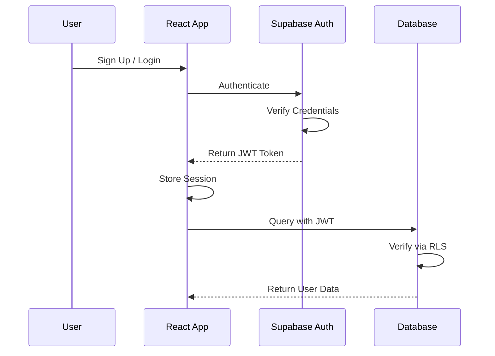
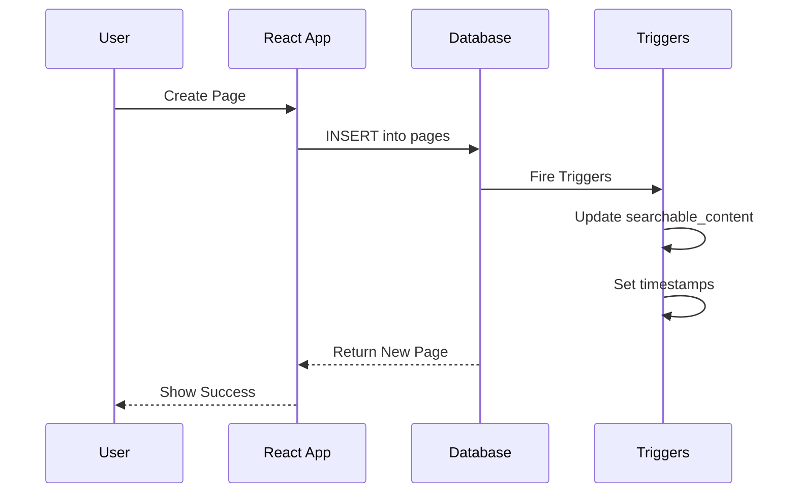
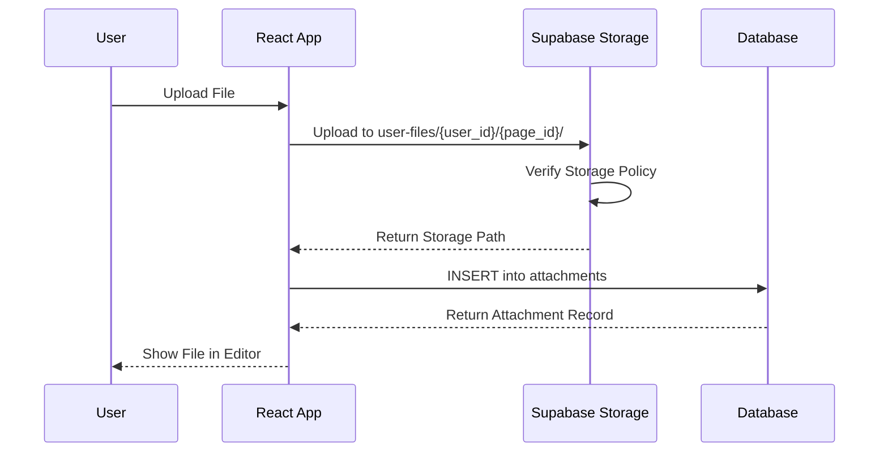
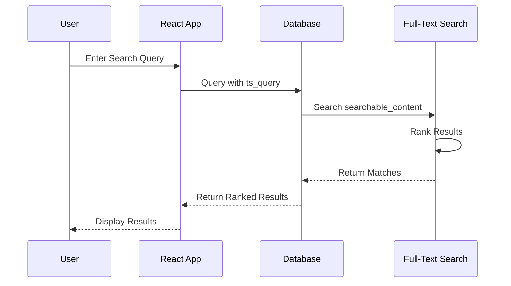
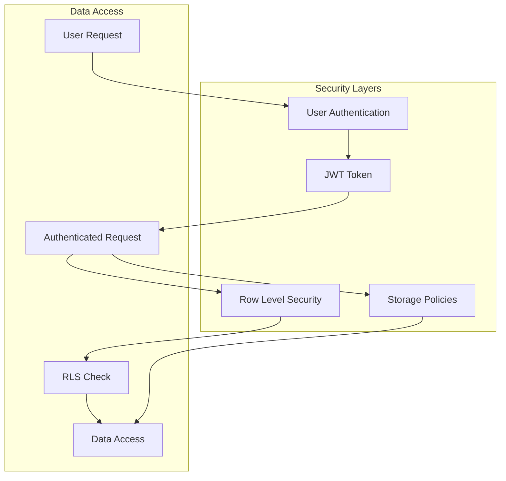
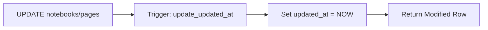
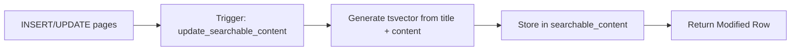

# Backend Architecture Overview

Visual overview of the Supabase backend architecture for the Web Note App.

## System Architecture



## Database Schema



## Data Flow

### Authentication Flow



### Page Creation Flow



### File Upload Flow



### Search Flow



## Security Architecture



## RLS Policy Structure

### Notebooks Table Policies

```sql
-- SELECT: View own notebooks
auth.uid() = user_id

-- INSERT: Create own notebooks
auth.uid() = user_id

-- UPDATE: Update own notebooks
auth.uid() = user_id

-- DELETE: Delete own notebooks
auth.uid() = user_id
```

### Pages Table Policies

```sql
-- SELECT: View own pages
auth.uid() = user_id

-- INSERT: Create own pages
auth.uid() = user_id

-- UPDATE: Update own pages
auth.uid() = user_id

-- DELETE: Delete own pages
auth.uid() = user_id
```

### Storage Policies

```sql
-- All operations check:
bucket_id = 'user-files' 
AND 
auth.uid()::text = (storage.foldername(name))[1]
```

## Trigger Architecture

### Automatic Timestamp Updates



### Full-Text Search Index



## Storage Structure

```
user-files/ (Bucket)
│
├── {user_id_1}/
│   ├── {page_id_1}/
│   │   ├── image1.png
│   │   ├── document.pdf
│   │   └── video.mp4
│   │
│   └── {page_id_2}/
│       └── diagram.svg
│
└── {user_id_2}/
    └── {page_id_3}/
        └── attachment.zip
```

## Performance Optimizations

### Indexes

```sql
-- Foreign key indexes
idx_notebooks_user_id
idx_pages_notebook_id
idx_pages_parent_page_id
idx_pages_user_id
idx_page_versions_page_id
idx_attachments_page_id

-- Full-text search index
idx_pages_searchable_content (GIN)
```

### Query Optimization

1. **User Data Queries**: Filtered by `user_id` index
2. **Notebook Pages**: Filtered by `notebook_id` index
3. **Page Hierarchy**: Filtered by `parent_page_id` index
4. **Search**: Uses GIN index on `searchable_content`

## Scalability Considerations

### Database
- Indexes on all foreign keys
- RLS policies prevent full table scans
- Efficient full-text search with GIN indexes

### Storage
- User-specific folders prevent conflicts
- Private bucket with policy-based access
- Supports large file uploads (configurable limit)

### Authentication
- JWT-based stateless authentication
- Session management handled by Supabase
- Automatic token refresh

## Backup and Recovery

### Automatic Backups
- Supabase provides automatic daily backups
- Point-in-time recovery available
- Backup retention based on plan

### Data Export
- Users can export their notebooks
- Markdown format for portability
- Includes file attachments

## Monitoring and Logging

### Available Metrics
- Database query performance
- Storage usage per user
- Authentication events
- API request logs

### Access Logs
- All queries logged by Supabase
- Storage access tracked
- Authentication attempts recorded

---

**Architecture Status:** ✅ Fully Designed and Documented  
**Implementation Status:** 🟡 Ready for Setup  
**Next Step:** Follow [SUPABASE_SETUP_GUIDE.md](./SUPABASE_SETUP_GUIDE.md)
